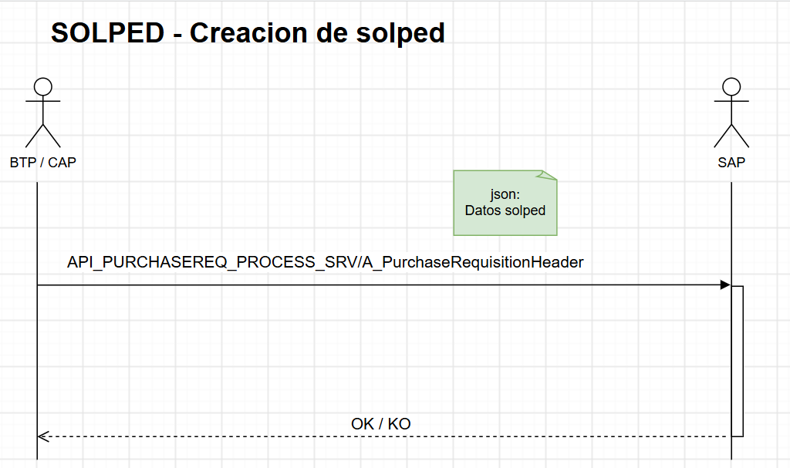
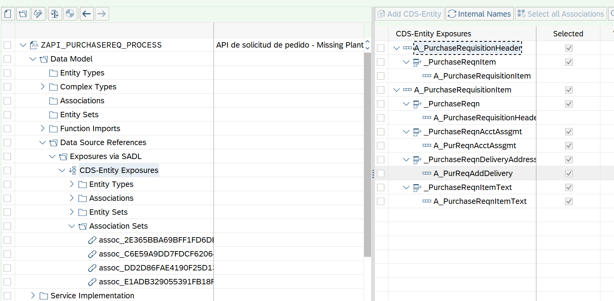
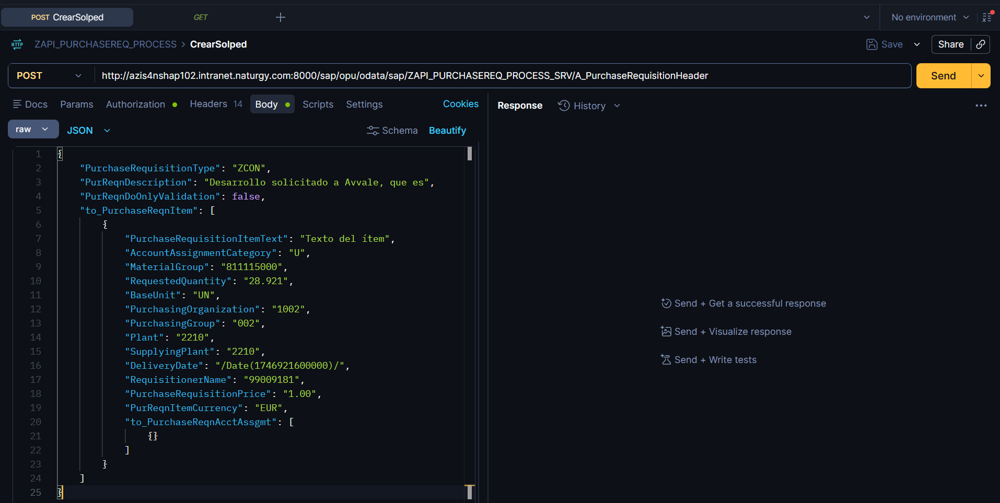
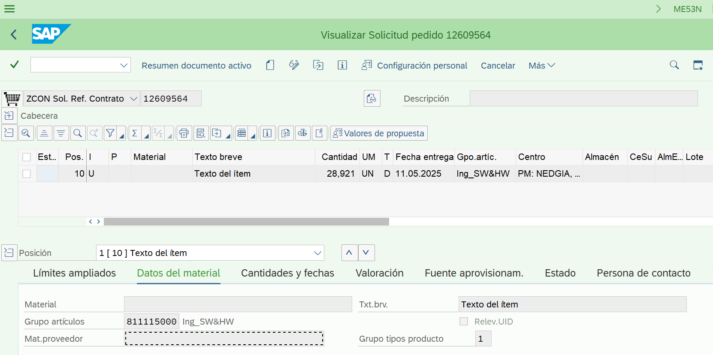

# Desarrollo de servicio OData V2 Deep insert

## Explicacion:


Se desea desarrollar un servicio OData V2 que permita la creación de solicitud de pedido.

Transacción ME51N 




## Modelo de datos basado en CDS estándar

#### CDS ROOT

[A_PurchaseRequisitionHeader](./otros/A_PurchaseRequisitionHeader.md)

#### CDS CHILD

[A_PurchaseRequisitionItem](./otros/A_PurchaseRequisitionItem.md)


## Proyecto SEGW - SAP Gateway service builder

Se crea proyecto para modificar una solicitud de pedidos (ME51N). 

Se crea el proyecto como exposición de una entidad CDS. Se expone CDS ROOT



Artefactos generados:

* ZAPI_PURCHASEREQ_PROCES_ANNO_MDL
* ZAPI_PURCHASEREQ_PROCESS_MDL
* ZAPI_PURCHASEREQ_PROCESS_SRV
* ZCL_API_PURCHASEREQ_P_DPC
* [ZCL_API_PURCHASEREQ_P_DPC_EXT](./otros/ZCL_MM_API_SOLPED_ATT_DPC_EXT.md)
* ZCL_API_PURCHASEREQ_P_MPC
* ZCL_API_PURCHASEREQ_P_MPC_EXT

### Prueba Postman - POST

> http://++++++++++++:8000/sap/opu/odata/sap/ZAPI_PURCHASEREQ_PROCESS_SRV/A_PurchaseRequisitionHeader



Fichero Json en Body de mensaje

``` json
{
    "PurchaseRequisitionType": "ZCON",
    "PurReqnDescription": "Desarrollo solicitado a Avvale, que es",
    "PurReqnDoOnlyValidation": false,
    "to_PurchaseReqnItem": [
        {
            "PurchaseRequisitionItemText": "Texto del ítem",
            "AccountAssignmentCategory": "U",
            "MaterialGroup": "811115000",
            "RequestedQuantity": "28.921",
            "BaseUnit": "UN",
            "PurchasingOrganization": "1002",
            "PurchasingGroup": "002",
            "Plant": "2210",
            "SupplyingPlant": "2210",
            "DeliveryDate": "/Date(1746921600000)/",
            "RequisitionerName": "99009181",
            "PurchaseRequisitionPrice": "1.00",
            "PurReqnItemCurrency": "EUR",
            "to_PurchaseReqnAcctAssgmt": [
                {}
            ]
        }
    ]
}
```

### Resultado

El listado de anexos de la solicitud debe mostrar los ficheros añadidos a la solped.

