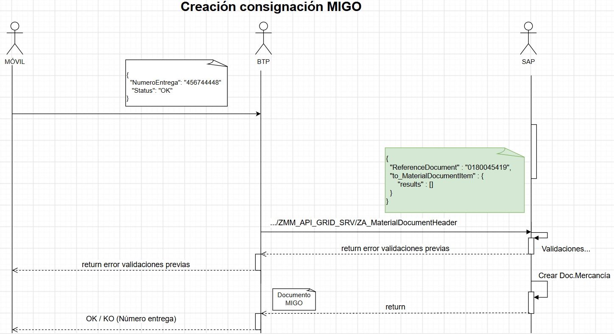
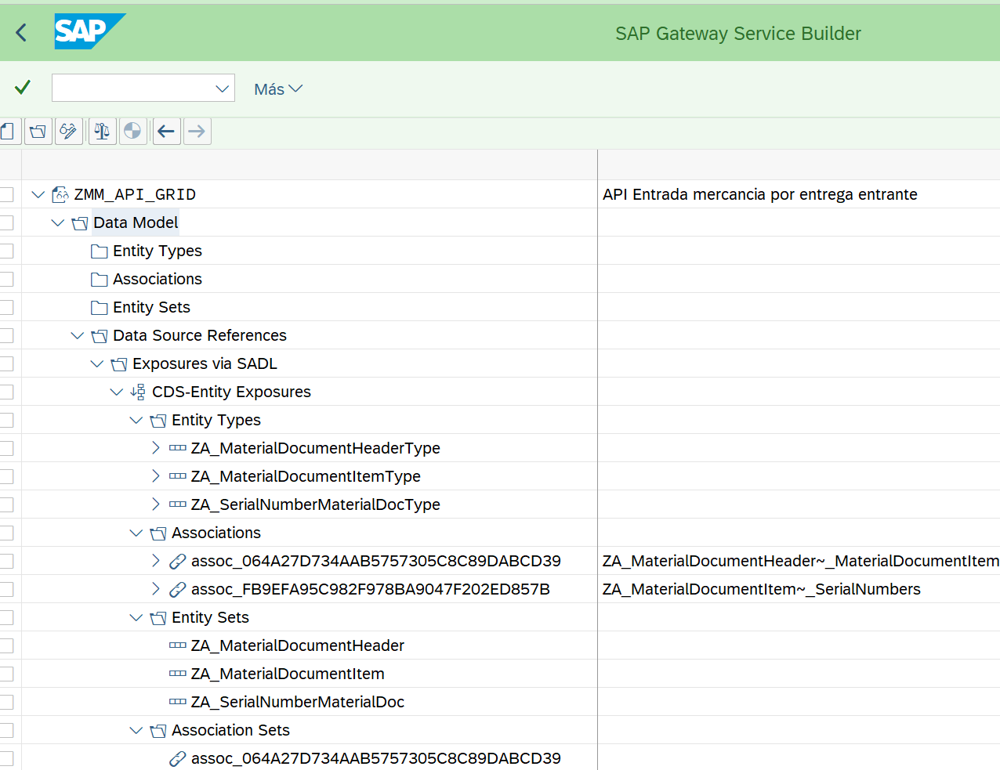
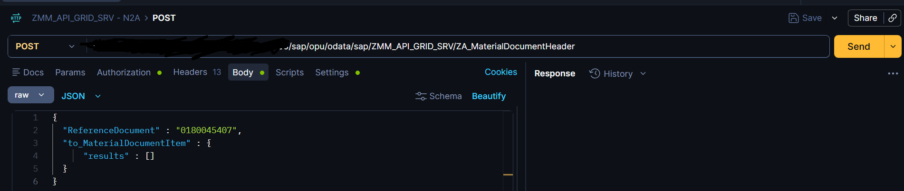
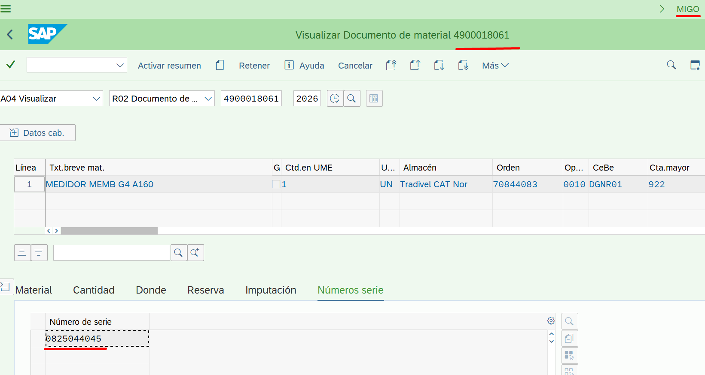

# Desarrollo de servicio OData V2 Deep insert

## Explicacion:
Se desea desarrollar un servicio OData V2 que permita la creación de movimientos de mercancía en función de una entrega entrante.

Transacción MIGO 




## Modelo de datos basado en CDS

#### CDS ROOT

[ZA_MaterialDocumentHeader](./otros/CDS_HEADER.md)

#### CDS CHILD

[ZA_MaterialDocumentItem](./otros/CDS_ITEM.md)

#### CDS HOJA

[ZA_SerialNumberMaterialDoc](./otros/CDS_SERIE.md)

## Proyecto SEGW - SAP Gateway service builder
Se crea proyecto para crear documentos de entrada de mercadería. 

Se crea el proyecto como exposición de una entidad CDS. Se expone CDS ROOT



Artefactos generados:
* ZCL_ZMM_API_GRID_DPC
* [ZCL_ZMM_API_GRID_DPC_EXT](./otros/ZCL_ZMM_API_GRID_DPC_EXT.md)
* ZCL_ZMM_API_GRID_MPC
* ZCL_ZMM_API_GRID_MPC_EXT
* ZMM_API_GRID_ANNO_MDL
* ZMM_API_GRID_MDL
* ZMM_API_GRID_SRV

### Clase Auxiliar

[ZCL_MATERIAL_DOCUMENT_API](./otros/ZCL_MATERIAL_DOCUMENT_API.md)

### Prueba Postman - POST



Fichero Json en Body de mensaje

``` json
{
  "ReferenceDocument" : "0180045407",
  "to_MaterialDocumentItem" : {
      "results" : []
  }
}
```

### Resultado

Se crea documento de entrada de mercancía, transacción MIGO, con referencia a entrega entrante.

