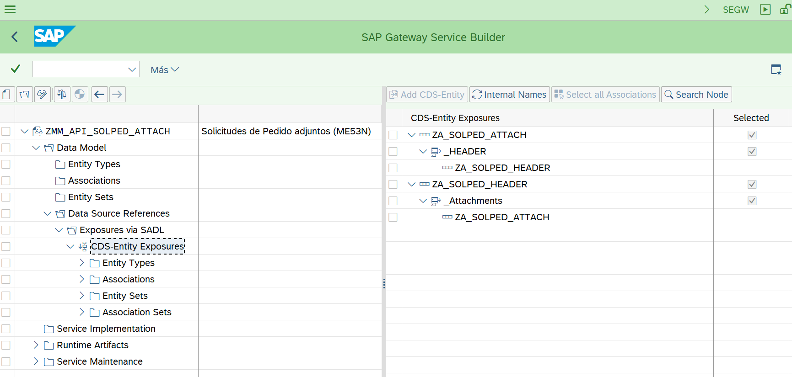
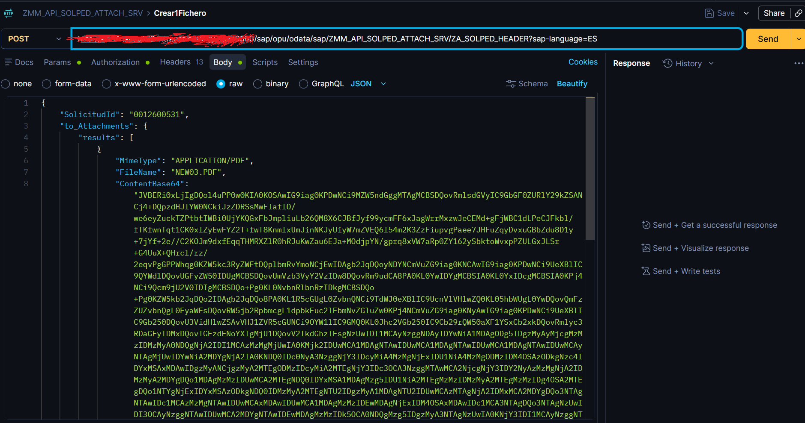
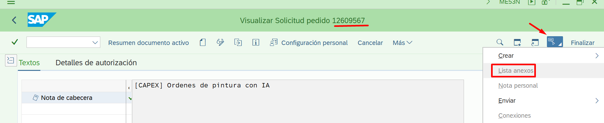

# Desarrollo de servicio OData V2 Function Import

## Explicacion:

Se desea desarrollar un servicio OData V2 que permita modificar el estado de usuario un equipo contador (objeto de PM)

Transacción IQ09 o IW32

## Modelo de datos basado en definicion de function import

## Proyecto SEGW - SAP Gateway service builder

Se crea proyecto para modificar estado de un equipo (IQ09). 

Artefactos generados:

* ZCL_EQUI_STATUS_AC_DPC
* [ZCL_EQUI_STATUS_AC_DPC_EXT](./otros/ZCL_EQUI_STATUS_AC_DPC_EXT.md)
* ZCL_EQUI_STATUS_AC_MPC
* ZCL_EQUI_STATUS_AC_MPC_EXT
* ZPM_EQUI_STATUS_ACTION_MDL
* ZPM_EQUI_STATUS_ACTION_SRV

### Clase auxiliar [zcl_cg_helper_equi](./otros/zcl_cg_helper_equi.md)

### Prueba Postman - POST

> /sap/opu/odata/SAP/ZPM_EQUI_STATUS_ACTION_SRV/ChangeStatus?Sernr='0723425623'&UserStatus='BLOQ'

### Resultado

Con la transaccion IQ09 o IE03 se puede ver la serie con el estado de usuario modificado

