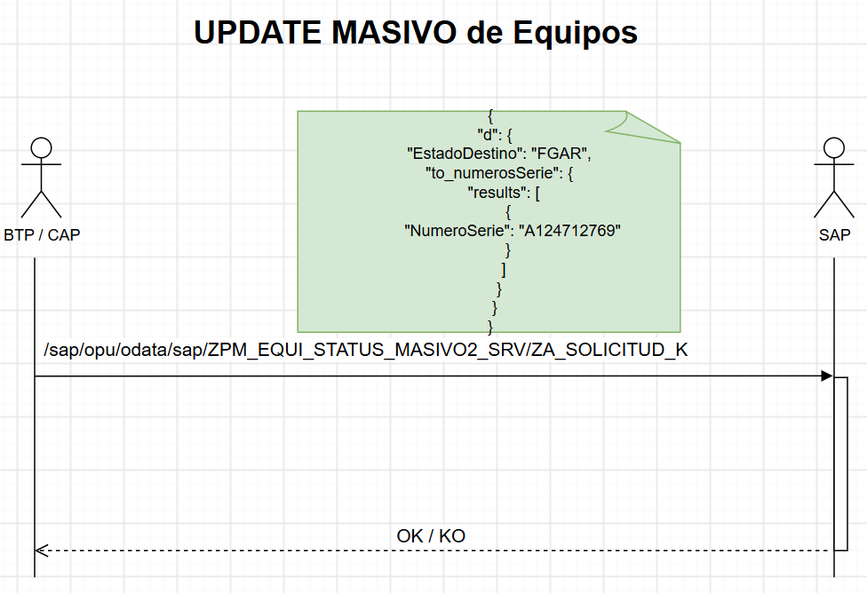
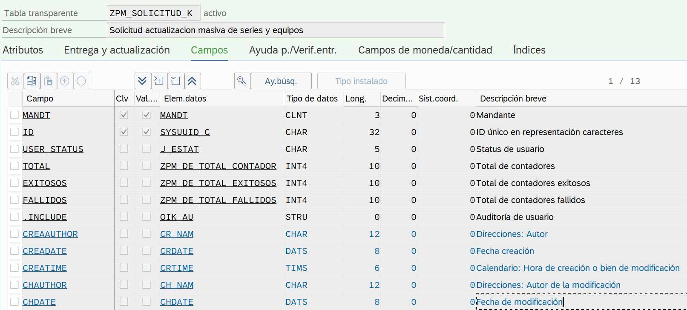
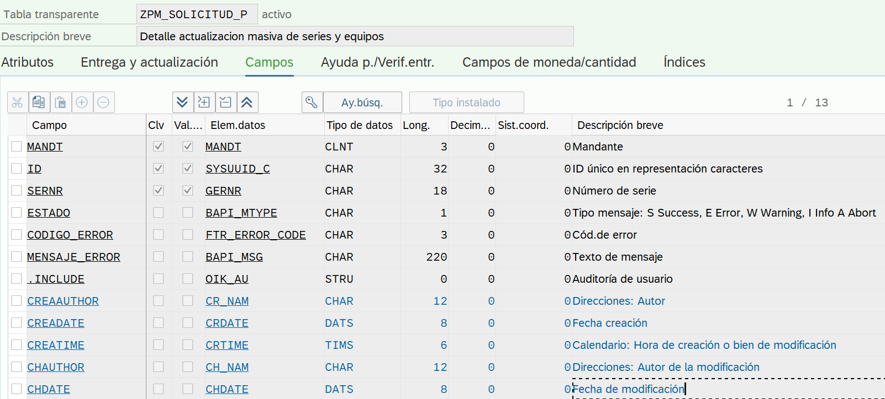
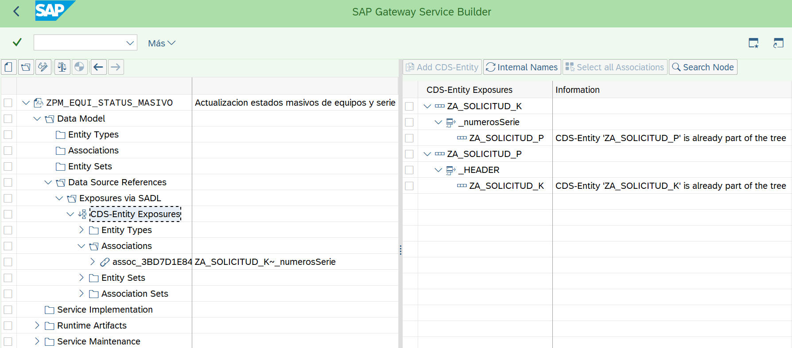
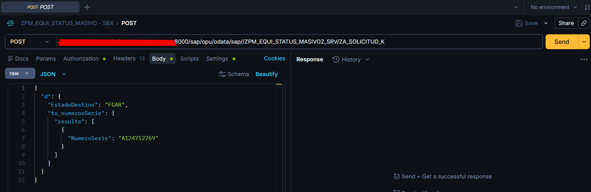
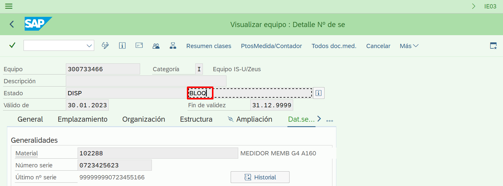

# Desarrollo de servicio OData V2 actualizacion masiva de estados de equipo

## Explicacion:

Se desea desarrollar un servicio OData V2 que permita modificar el estado de usuario muchos equipos de contador (objeto de PM) en una única llamada



Transacción IQ09 o IW32 

## Modelo de datos basado en CDS


#### CDS ROOT

[ZA_SOLICITUD_K](./otros/ZA_SOLICITUD_K.md)

Tabla BB.DD cabecera



#### CDS CHILD

[ZA_SOLICITUD_P](./otros/ZA_SOLICITUD_P.md)

Tabla BB.DD posicion




## Proyecto SEGW - SAP Gateway service builder

Se crea proyecto para modificar estado de un equipo (IQ09). 

Se crea el proyecto como exposición de una entidad CDS. Se expone CDS ROOT




Artefactos generados:

* ZCL_PM_EQUI_STATUS_MA_DPC
* [ZCL_PM_EQUI_STATUS_MA_DPC_EXT](./otros/ZCL_PM_EQUI_STATUS_MA_DPC_EXT.md)
* ZCL_PM_EQUI_STATUS_MA_MPC
* ZCL_PM_EQUI_STATUS_MA_MPC_EXT
* ZPM_EQUI_STATUS_MASI_ANNO_MDL_01
* ZPM_EQUI_STATUS_MASIVO2_MDL
* ZPM_EQUI_STATUS_MASIVO2_SRV

### Clase auxiliar [zcl_cg_helper_equi](./otros/zcl_cg_helper_equi.md)

### Prueba Postman - POST

> http://++++++++++++++++++++++:8000/sap/opu/odata/sap//ZPM_EQUI_STATUS_MASIVO2_SRV/ZA_SOLICITUD_K





### fichero json

``` json
{
  "d": {
    "EstadoDestino": "FGAR",
    "to_numerosSerie": {
      "results": [
        {
          "NumeroSerie": "A124712769"
        }
      ]
    }
  }
}
```

### Resultado

Con la transaccion IQ09 o IE03 se puede ver la serie con el estado de usuario modificado

