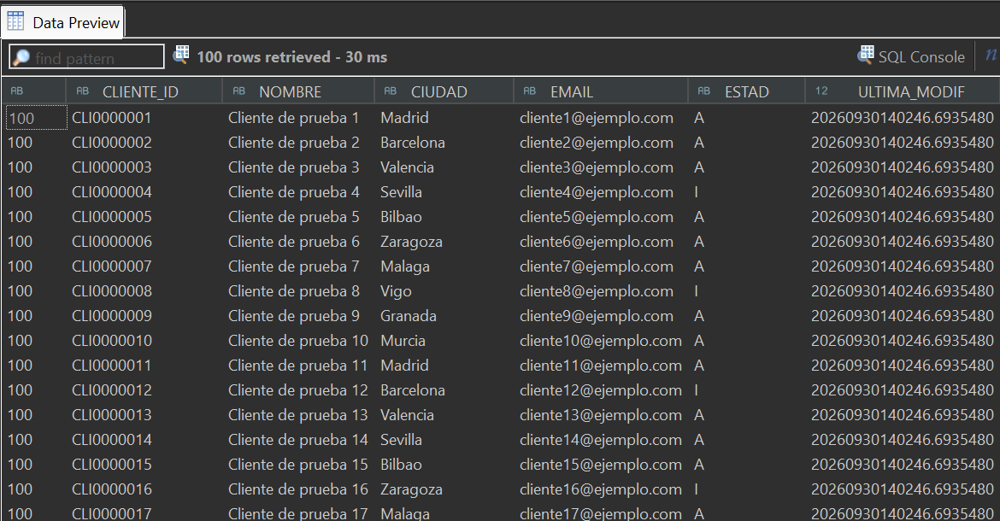
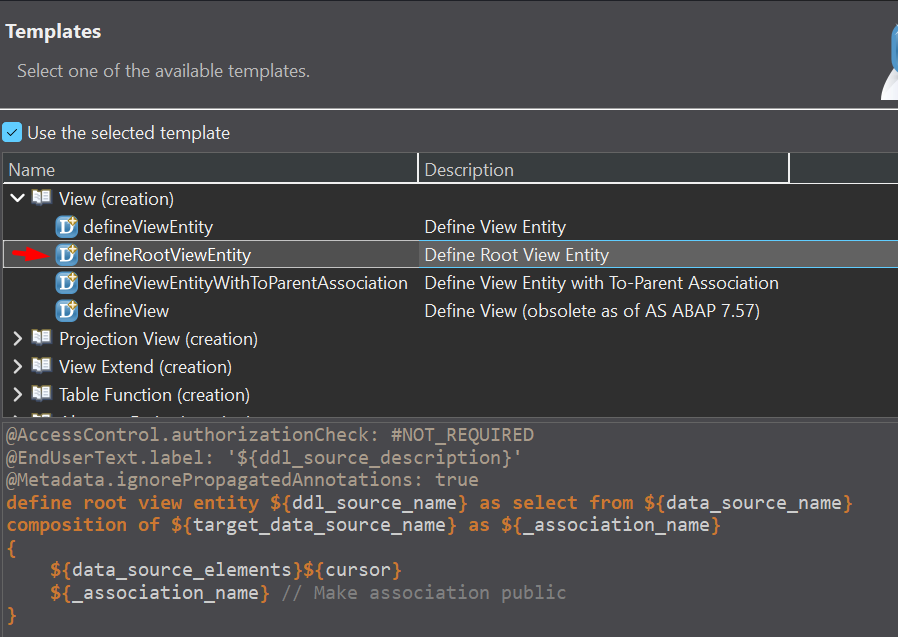
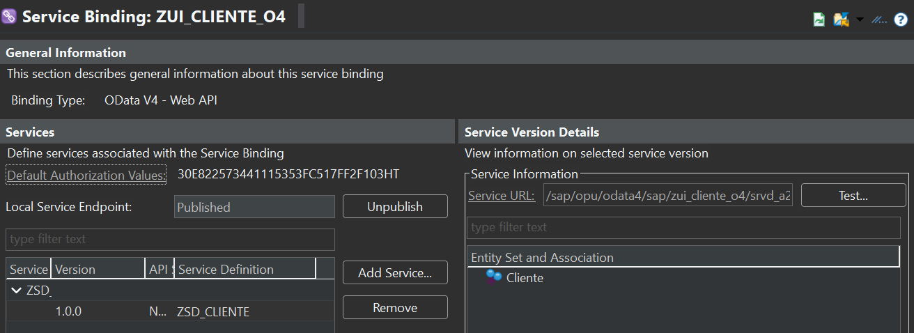
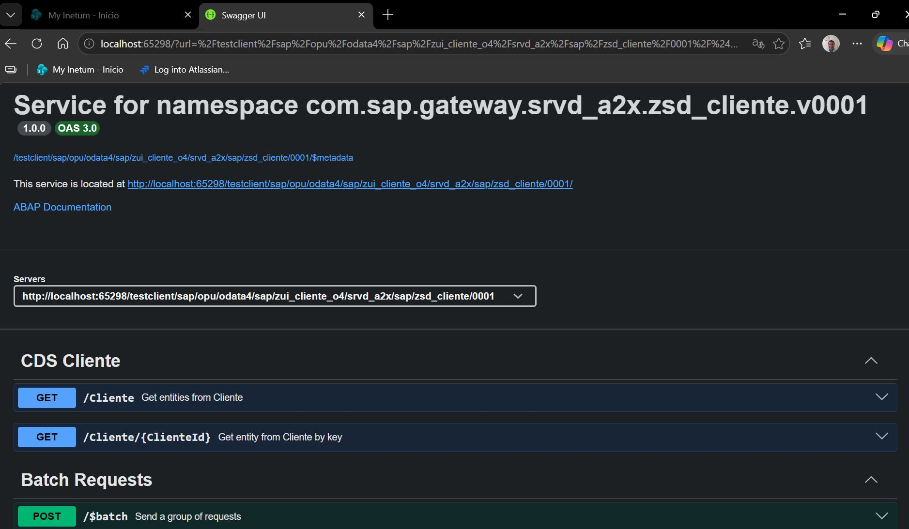
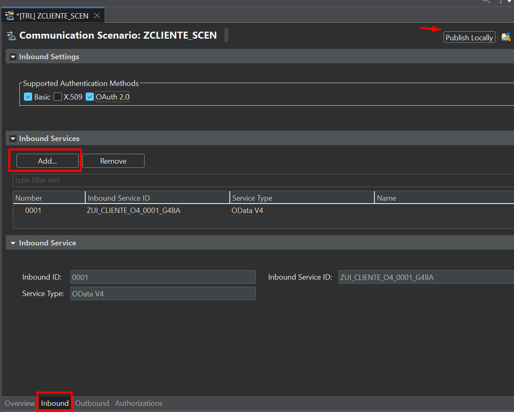
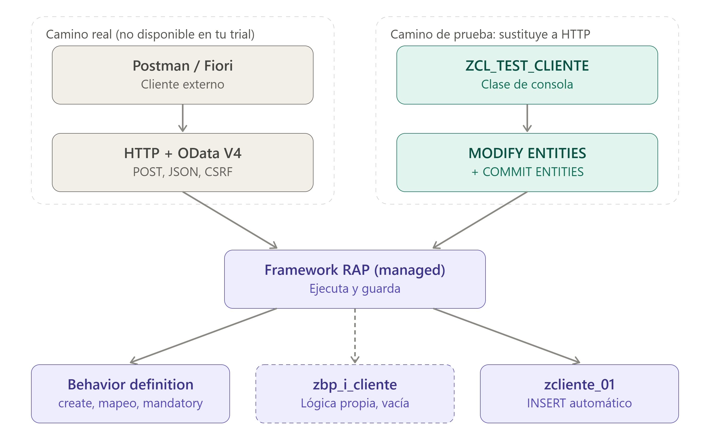

# Servicio OData V4 en BTP CLOUD sin SEGW

## Explicacion:

CRUD básico sobre una sola tabla Z, el equivalente a lo que se puede hacer con SEGW. 


|Fase	| Objetivo|
|:---:|-----------|
|0	| Tabla Z y datos de prueba |
|1	| GET de la colección y GET por clave |
|2	| POST |
|3	| PATCH (y PUT para comparar) |
|4	| DELETE |


## Fase 0: Tabla y datos de prueba

``` js
@EndUserText.label : 'Clientes - ejercicio RAP'
@AbapCatalog.enhancement.category : #NOT_EXTENSIBLE
@AbapCatalog.tableCategory : #TRANSPARENT
@AbapCatalog.deliveryClass : #A
@AbapCatalog.dataMaintenance : #RESTRICTED
define table zcliente_01 {

  key client     : abap.clnt not null;
  key cliente_id : abap.char(10) not null;
  nombre         : abap.char(40);
  ciudad         : abap.char(30);
  email          : abap.char(60);
  estado         : abap.char(1);
  ultima_modif   : timestampl;

}
```

Clase para cargar datos ficticios

[Cargar tabla Z](./otros/zcl_carga_cliente.md)

Se ejecuta Clase con F9 y se cargan datos.




## Fase 1: GET de la colección y GET por clave

Aquí no hay código de negocio. Declaras el modelo y el framework hace el resto.

### Qué crear (en este orden)

#### 1. CDS view entity `ZI_CLIENTE`

Seleccionar este template **defineRootViewEntity**



``` abap
@AccessControl.authorizationCheck: #NOT_REQUIRED
@EndUserText.label: 'CDS Cliente'
@Metadata.ignorePropagatedAnnotations: true

define root view entity ZI_CLIENTE
  as select from zcliente_01

{
  key cliente_id   as ClienteId,
      nombre       as Nombre,
      ciudad       as Ciudad,
      email        as Email,
      estado       as Estado,
      ultima_modif as UltimaModif

}
```
* Es root porque en la Fase 2 le añadiremos el behavior.

#### 2. Service definition ZSD_CLIENTE

``` abap
@EndUserText.label: 'Service Definition on CDS'
define service ZSD_CLIENTE {
  expose ZI_CLIENTE as Cliente;
}
```

El alias Cliente será el nombre del entity set en la URL.

#### 3. Service binding ZUI_CLIENTE_O4

* Binding Type: OData V4 - Web API.
* Service Definition: ZSD_CLIENTE.
* Activar y publicar (Publish).



Con esto ya se puede probar presionando **Test**



Equivalencias de consulta en BTP

con SEGW

/sap/opu/odata/sap/API_PURCHASECONTRACT_PROCESS_SRV/A_PurchaseContract?$top=2

Con BTP

http://localhost:49370/testclient/sap/opu/odata4/sap/zui_cliente_o4/srvd_a2x/sap/zsd_cliente/0001/Cliente?$top=3


con SEGW

/sap/opu/odata/sap/ZAPI_PURCHASEREQ_PROCESS_SRV/$metadata

Con BTP

http://localhost:49370/testclient/sap/opu/odata4/sap/zui_cliente_o4/srvd_a2x/sap/zsd_cliente/0001/$metadata

## Cómo probarlo

Como estás en BTP, la autenticación con Postman requiere configuración extra (OAuth), así que empieza por una vía más simple. En el service binding, ya publicado, verás la lista de Entity Sets y la Service URL. Abre esa URL en el navegador: te pedirá iniciar sesión con tu usuario de BTP y después podrás lanzar los GET escribiendo la URL directamente. Todas las llamadas de esta fase son de lectura, así que el navegador basta. Cuando lleguemos al POST, configuramos Postman.

## Pruebas para dar la fase por válida

1. `GET <Service URL>/$metadata`: aparece el entity type ClienteType, con las propiedades ClienteId, Nombre,  Ciudad, Email, Estado y UltimaModif. No aparece client.
2. `GET <Service URL>/Cliente`: devuelve los registros en JSON dentro de value.
3. `GET <Service URL>/Cliente/$count`: devuelve 100.
4. `GET <Service URL>/Cliente('CLI0000001')`: devuelve un solo registro, ya sin el array value.
5. `GET <Service URL>/Cliente('CLI9999999')`: devuelve un error 404.
6. Consultas OData sobre la colección:
* `?$top=5`: 5 registros.
* `?$filter=Estado eq 'I'`: solo los inactivos (25 registros).
* `?$select=ClienteId,Nombre`: solo esas dos propiedades.
* `?$orderby=Nombre desc&$top=3`: ordenación descendente.

## Qué debes entender antes de seguir
La CDS view entity es el entity set. No has escrito ningún `GET_ENTITYSET`.
En V4 la clave va entre paréntesis con comillas simples si es texto.
`$filter`, `$select`, `$orderby`, `$top` y `$count` funcionan sin programar nada.

#### 4. Lo que va a costar más: probar con Postman 

Si quieres llamar al servicio desde Postman, sí, es obligatorio. En ABAP Environment, para exponer servicios ABAP a una comunicación técnica hay que agruparlos en un `Communication Scenario`. Es el mecanismo de seguridad de BTP: sin scenario, el servicio no es accesible para un consumidor externo. Se hace una sola vez y son tres objetos (`scenario`, `system con usuario`, `arrangement`), unos 15 minutos y no se vuelve a tocar.

## Crear el scenario Communication Scenario

Parado sobre el paquete Z, click derecho 
***New → Other ABAP Repository Object*** y y selecciona ***Communication Scenario***.

El artefacto scenario abre en un editor con varias pestañas.

## Añadir tu servicio

1. Ve a la pestaña Inbound.
2. Pulsa Add....
2. En Service Type elige **OData V4** (en la lista puede aparecer como G4BA, que corresponde a OData 4.0).
4. Selecciona tu servicio, relacionado con `ZUI_CLIENTE_O4`, en el desplegable o en la lista de servicios disponibles. Si no aparece, comprueba que el service binding sigue publicado.
5. Pulsa *OK* o *Finish*.

## Guardar y activar

1. Guarda con Ctrl+S.
2. Activa con Ctrl+F3.
3. Publicar con `Publish Locally`, para que el scenario quede disponible en el sistema.



Con SAP BTP Trial no se tienen los permisos necesarios para ejecutar las aplicaciones para crear usuarios técnicos de prueba y tampoco Communication Arrangement. Por ello no se pueden completar los puntos necesarios.

una pregunta mas, ya sea que se hubiera podido probar pro HTTP de verdad, igual se iba a necesitar del artefacto behavior?

Sí, para el **POST**, **PATCH** y **DELETE** habrías necesitado el behavior definition igualmente.

* Sin `behavior definition`, el servicio es de solo lectura. La CDS y la service definition exponen el `GET` (colección, por clave, `$filter`, `$select`, etc.), pero RAP no genera ninguna operación de escritura. Un POST te daría un error, porque el $metadata no declara que se pueda crear, actualizar o borrar.
* **El behavior es quien activa cada operación**. Cada línea (`create`;, `update`;, `delete`;) habilita el verbo HTTP correspondiente: `POST`, `PATCH/PUT` y `DELETE`. Es el equivalente a implementar `CREATE_ENTITY`, `UPDATE_ENTITY` y `DELETE_ENTITY` en SEGW, solo que aquí se declara.
* **HTTP y EML son dos puertas al mismo behavior**. Una petición `POST` y un `MODIFY ENTITIES ... CREATE` desde una clase terminan ejecutando la misma lógica. Por eso lo que aprendas con EML te vale tal cual cuando llames por HTTP.


## Lo que has visto de RAP frente a SEGW

|       | SEGW (V2)	| RAP (V4) |
|-------|-----------|-----------|
|Modelo	| Entity types y sets definidos a mano	| Una CDS view entity
|Lectura (`GET`, `$filter`...)	| Programas `GET_ENTITYSET` y `GET_ENTITY`	| Sin código: publicas la CDS
|Creación	| Programas `CREATE_ENTITY`	| `create`; en el behavior, y con `managed` ni siquiera programas el INSERT
|Publicación	| `/IWFND/MAINT_SERVICE`	| Service definition y binding
|Pruebas	| `/IWFND/GW_CLIENT` o Postman con tu usuario	| Depende del entorno

Con RAP escribes bastante menos código, pero tienes que entender más conceptos (CDS, behavior, transacción y save sequence).

Pregunta

"...no deberia ser la clase "zbp_i_cliente" quien implemente el código que has preparado para la clase "zcl_test_cliente"?..."

No, son dos papeles distintos, y es fácil confundirlos viniendo de SEGW.

## Quién es quién

* `zbp_i_cliente` (behavior implementation) es el lado del servidor. Es donde va la lógica propia de negocio: validaciones, determinaciones, acciones o, en un modelo `unmanaged`, el INSERT que programas tú. Es lo más parecido al `DPC_EXT` de SEGW.
* `zcl_test_cliente` es el cliente que llama al behavior. Hace el papel de Postman o de la app Fiori: pide "crea este cliente" y mira qué responde el framework.

## Por qué el código de la clase de prueba no va en zbp_i_cliente

Ese código (`MODIFY ENTITIES` + `COMMIT ENTITIES`) dispara el behavior, no lo implementa. Si lo metieras dentro de `zbp_i_cliente`, el behavior se llamaría a sí mismo: la clase de implementación pediría crear un cliente, eso volvería a ejecutar el behavior, y así sucesivamente. No tiene sentido.

Con `managed` además no hay código de persistencia que escribir: el framework hace el INSERT en `zcliente_01` por ti. Por eso la clase `zbp_i_cliente` la dejamos vacía.

## La comparación con SEGW
|SEGW	| RAP |
|-----|-----|
|DPC_EXT → CREATE_ENTITY (la lógica de creación) | Behavior definition (create;) + zbp_i_cliente si hay lógica propia
|Gateway + Postman llamando al servicio	| `zcl_test_cliente` o una llamada HTTP

## Cuándo sí se escribe código en `zbp_i_cliente`

Cuando necesites algo que el framework no hace solo. Por ejemplo, una validación que rechace un `Estado` distinto de `A` o `I`. Se declara en el behavior definition y se programa en la clase de implementación:

```js
validation checkEstado on save { create; field Estado; }
```

Entonces `zbp_i_cliente` tendría un método que revisa el estado y rellena `failed` y `reported` si es inválido. Y tu `zcl_test_cliente` seguiría igual: lo único que cambiaría es que, al lanzarla con un estado erróneo, el `COMMIT ENTITIES` devolvería el fallo.

Si quieres ver esto en acción, es un buen siguiente paso: añadir esa validación y probarla con tu clase de prueba, mandando un `Estado = 'X'`.

## Resúmen



Ahora el behavior aparece repartido en sus tres piezas, que es como funciona de verdad.

* **Behavior definition**: es la declaración. Dice qué operaciones existen (`create`;), cómo se mapean los campos y cuáles son obligatorios. El framework la consulta en cada petición, venga de HTTP o de tu clase de prueba. Es un artefacto que se lee, no un código que se ejecuta.
* `zbp_i_cliente`(línea discontinua): es la implementación, es decir, el código propio. Va con trazo discontinuo porque es opcional. Con `managed` y sin validaciones ni determinaciones, el framework no la necesita y por eso está vacía. Cuando añadas una validación, el framework la llamará desde aquí.
* **Framework RAP (managed)**: es el que une todo. Recibe la petición, lee la definición, llama a tu clase si hay lógica propia y hace el INSERT en `zcliente_01`.

Esto también aclara lo que hablábamos antes. Tu ZCL_TEST_CLIENTE no toca ninguna de esas tres piezas directamente: solo entrega la petición al framework, igual que lo haría HTTP.

**La clase que sustituye a HTTP** es `ZCL_TEST_CLIENTE`. Hace el papel de Postman o de la app Fiori, y con `MODIFY ENTITIES` + `COMMIT ENTITIES` se salta toda la capa de HTTP: autenticación, token CSRF, parseo del JSON y códigos de respuesta.

[ZI_CLIENTE](./otros/ZI_CLIENTE.md)

[ZCL_TEST_CLIENTE](./otros/zcl_test_cliente.md)
